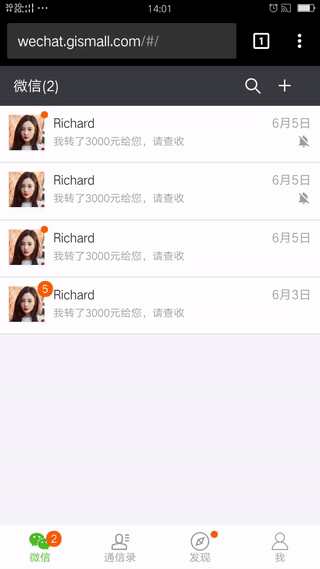

# Fack Wechat App based on Koa2, MongoDB, Redis, WebRTC，WebSocket, React, Antd Mobile, Dva

> 前言： 
> 计划在团队内部做一个使用webrtc做实时音视频聊天实现的分享。既然是分享，就得有App演示和提> 供现场体验吧。要给别人看，界面总得做一个吧？ 没有UX, 因此，想到了直接Fake一个Webchat用户界面： 一是个人非常喜欢微信界面，设计得很简单，易用，组件抽象得很好，实现也相对简单，btw, 顺便吐槽下我厂的某少数部分UX， 设计不是提取共性，而想方设法的创造各种奇怪的特性，也不遵循一定的规范，让你拿到交互稿不知道如何去抽你的设计组件。二是刚好可以练习下h5开发。到厂内后，只参与了一个toC的互动和几个toB的小移动项目的开发，这次刚好可学习下。
刚开始API想部分调用web.wechat的API减少工作量，抓包看了下还是挺复杂的，因此，还是决定自己写反正也需要写信令服务器，刚好可以一起。

* 应用地址： [http://wechat.gismall.com/](http://wechat.gismall.com/) 
  扫一扫  
  
* 大致效果，后面完整实现了再贴一个demo
  
* 前端仓库地址： [https://github.com/hsuehic/react-wechat](https://github.com/hsuehic/react-wechat)
* 后台他库地址： [https://github.com/hsuehic/react-wechat-backend](https://github.com/hsuehic/react-wechat-backend)

## Features

- [ ] 前端界面
  - [x] 微信
    - [ ] 视频对话
    - [ ] 语音对话
    - [ ] 发消息
    - [ ] 多人视频
  - [x] 联系人
    - [ ] 联系人详情
  - [x] 发现
    - [ ] 朋友圈
    - [ ] 附近的人
    - [ ] 摇一遥
  - [x] 我
    - [ ] 相册
    - [ ] 设置
- [ ] 后端接口(Websocket协议)
  - [ ] 登录、注册
  - [ ] 获取聊天记录（微信界）
  - [ ] 获取对话详情（文本、语音片段、图片）
  - [ ] 附近的人
  - [ ] 摇一摇
- [ ] 通用功能
  - [ ] 传文件
  - [ ] 会话

## Contribute
欢迎一起玩耍！

## Reference

* [Install nginx](https://www.digitalocean.com/community/tutorials/how-to-install-nginx-on-ubuntu-16-04)
* [Install Redis](https://redis.io/topics/quickstart)
* [Install MongoDB](https://docs.mongodb.com/manual/tutorial/install-mongodb-on-os-x/)